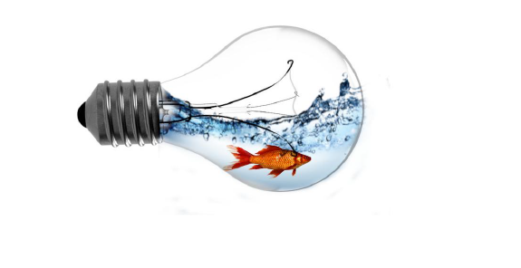

# 🐟 Fish in a Bulb – GIMP Photo Manipulation  

This project was created as part of my GIMP practical assignment.  
The concept is a surreal composition of a **goldfish swimming inside a light bulb filled with water**.  
It demonstrates the use of **photo manipulation techniques** in GIMP.  

---

## 🛠 Tools & Techniques  
- **Software**: GIMP  
- **Skills practiced**:  
  - Layer masking  
  - Transparency adjustment  
  - Object selection and scaling  
  - Image blending and composition  

---

## 🎨 Final Output  
  

---

## 📂 Project Files  
- `image.png` → Final exported image (PNG)  
- `project.xcf` → Original GIMP editable file (layers included)  

---

## ✨ Learning Outcome  
Through this project, I practiced:  
- Combining multiple images into a single creative artwork.  
- Using GIMP’s **layer system** effectively.  
- Improving precision in **object masking** and **positioning**.  

---

## 📌 About  
This is part of my journey in **graphic design and digital creativity**.  
Even though it’s a beginner-level project, it reflects my **creativity, attention to detail, and design practice**.  

 
